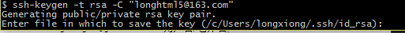

# firstblood
firstblood

说说我的git路程

1、傻瓜安装 
2、add new repository 
3、点击图标copy地址 
4、打开终端，cd进入自己的github文件夹，输入命令 git clone '复制的地址' 
5、配置sshkey  命令：ssh-keygen -t rsa -C '注册邮箱'
				-->打开所指目录
				-->复制id_rsa.pub里边的信息。 
				-->进入github的settings > SSH and GPG keys >new SSH key (title随意) 
6、add->commit (commit后进入注释编辑模式，退出方式：esc键，软后键入":x",回车退出). 
7、键入命令git config --global credential.helper store 解决每次push都需要输入密码的问题。
8、如果要使项目能够通过网站打开，需在项目的settings-GitHub Pages下进行设置
